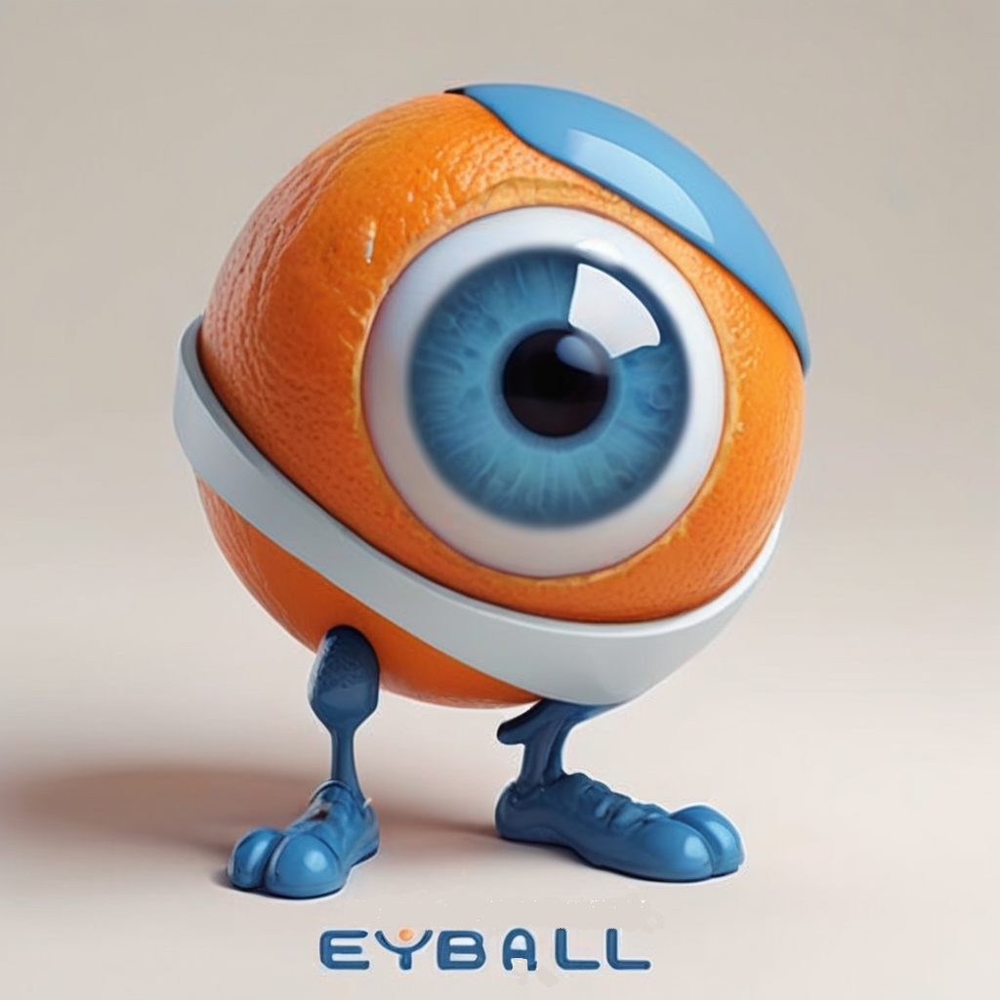
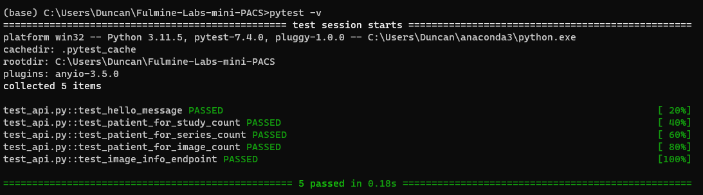
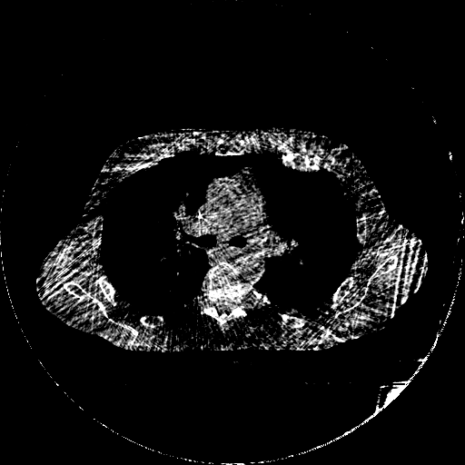
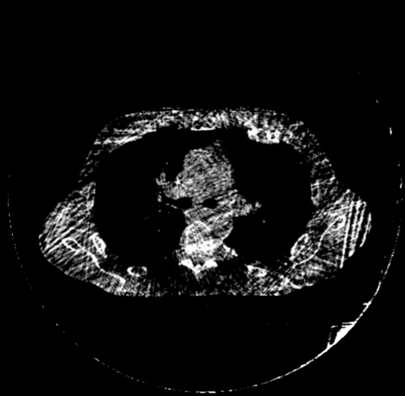
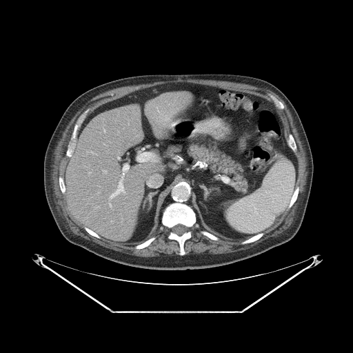
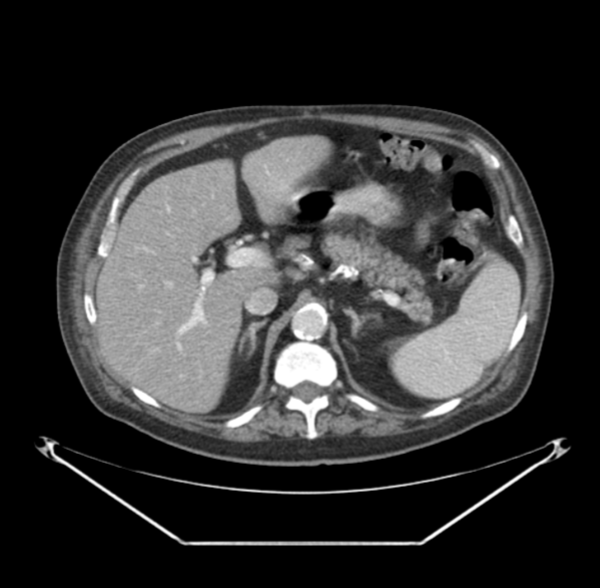

# Fulmine Labs mini-PACS (aka Eyball)

Implement a basic Picture Archive Communication System (PACS) to manage DICOM images.
Use these images to implement an anomaly detection system, to help with test automation.



Date: 3/2/2024

Fulmine Labs LLC

## Overview
The challenge: Fulmine Labs will use medical images for quality/testing related, machine learning (ML) initiatives. 
The best practice for managing this data is to use Digital Imaging and Communications in Medicine (DICOM) standard compliant images with a PACS-like system.

The code in this project implements and tests a basic PACS with the following architecture:

```
[ Orthanc Repository (Open Source component) ]
       |
       | (DICOM Images) <----------------------------------------->  [ OHIF Viewer (Open Source component) ]
       v
[ Fulmine-Labs-Mini-PACS - Data Setup Script ]      
       |								
       | (Metadata and generated images)   
       |                                          
[ SQLite Database ]							
       |								
       | (API Requests)						 
       v
[ Flask Application ]
       |
       | (HTTP Requests for Data)
       v
[ Client (Pytest, Browser) ]
       |
       | (Model Training Data)
       v
[ Anomaly Detection Model Training Script (separate repository) ]

```

The data setup script will traverse all folders in a specified location, identify DICOM images and if they have appropriate Window Center and Width DICOM header information, will convert them to PNG files at another specified location and add the related metadata to an SQLite database. 

The database maintains the Patient -> Study -> Series -> Image relationship, as well as tracking the output image file names and parameters used in their creation, allowing PACS-like SQL queries to be constructed. 

Currently supported endpoints (usually at `http://127.0.0.1:5000`) are:

* '/' - welcome message
* '/patients/<patient_id>' - get patient information
* '/studies/<study_id>' - get study information
* '/series/<series_id>' - get series information
* '/images/<image_id>' - get image information
* '/patients/<patient_id>/studies' - get studies for a patient
* '/patients/<patient_id>/studycount' - get study count for a patient
* '/patients/<patient_id>/seriescount' - get series count for a patient
* '/patients/<patient_id>/imagecount' - get image count for a patient
* '/patients/<patient_id>/counts' - get all counts for a patient
* '/patients/count' - get total patient count
* '/studies/count' - get total studies count
* '/series/count' - get total series count
* '/images/count' - get total images count
* '/imageinfo/<filename>' - get image info by providing the file name

Once PNG images have been generated from the DICOM images, these are used as the basis of the 'valid' class in an ML image classifier. To reduce overfitting, additional images are generated and added to the valid class. These include:

* The same images with random window centers and widths
* The same images with light random blurring to simulate pixel interpolation or compression
* The same images with flips and rotations
* The same images zoomed in and out, also with  random window centers and widths

The 'invalid' class will be comprised of, for example:

* Non-medical images selected from the Kaggle 'real and fake' dataset
* The same valid images as above with simulated error/message boxes in order to help to detect anomalous conditions
* Some custom anomalous images, including AI-generated medical images

All of the images above will be distributed randomly between training, validation and testing folders in order to train and test the model.
In addition, in order to test how well the model recognizes previously unseen medical images of the same type, some custom images will be selected from Google searches and used only for testing.

Overall the folder structure looks like this:

```
Orthanc (DICOM images)
  ├── subfolders

training (PNG)
  ├──train
  ├──validate
  ├──test

Kaggle_real_and_fake_images (PNG)
  ├── subfolders

Custom_invalid (MIX)
  ├── subfolders

Custom_test_valid

training_images
  ├──train
  │		├── valid
  │		│  original training
  │		│   ├── blurred
  │		│   └── window_leveled
  │		│   └── rotate_and_flip
  │		│   └── zoomed
  |             |     └── window_leveled
  │		└── invalid/
  │   		 	├── Kaggle_real_and_fake_images
  │    	 		├── copied from Custom_invalid
  ├──validate
  │		├── valid
  │		│  original validate
  │		│   ├── blurred
  │		│   └── window_leveled
  │		│   └── rotate_and_flip
  │		│   └── zoomed
  |             |     └── window_leveled
  │		└── invalid/
  │   		 	├── Kaggle_real_and_fake_images
  │    	 		├── copied from Custom_invalid
  ├──test
 	├── valid
 	│  original test
		├── copied from Custom_test_valid
 	└── invalid/
     	 	├── Kaggle_real_and_fake_images
      	 	├── copied from Custom_invalid

```

Once the data is prepared, the classifier model training is initiated. 
The model is saved and reloaded and used to test those images selected for testing, producing metrics on Accuracy, Precision, Recall and F1 score.

## Datasources used

* The Cancer Imaging Archive.
* The Artifact 'Real and Fake' dataset from Kaggle.

## Current Version
The current stable version of the project is 0.2.1.
See the [CHANGELOG.md](CHANGELOG.md) file for details about this version.

## Prerequisites

* Anaconda, with an environment having the Python libraries listed in [requirements.txt](requirements.txt)
* The Orthanc open source DICOM server (optional)
* The OHIF Viewer integrated with Orthanc (optional). For this you will need a [Github](https://github.com/) account and Node Package Manager -> nodejs -> yarn.
* DICOM images
* The [Artifact](https://www.kaggle.com/datasets/awsaf49/artifact-dataset) Real and Fake image dataset from Kaggle

## Usage

Install Anaconda, create an environment and install the dependencies in requirements.txt

1) Orthanc Installation and configuration (if you need to download images):

* Install the Orthanc open source DICOM server from https://www.orthanc-server.com/
* Configure Orthanc by modifying the orthanc.json configuration file. 
This includes setting parameters like storage directories, enabling the DICOM and HTTP servers, and specifying network settings such as the port (defaults to 8042).
* Enable the CORS (Cross-Origin Resource Sharing) configuration in Orthanc by adding the following lines to Orthanc.json:

`"HttpServer" : {
  "EnableCors" : true,
  "CorsAllowedOrigins" : [ "*" ],
  "CorsAllowedMethods" : [ "GET", "POST", "PUT", "DELETE", "HEAD", "OPTIONS" ],
  "CorsAllowedHeaders" : [ "*" ]
}`

* Ensure that Orthanc is running properly by accessing its web interface: http://localhost:8042.
* Use Orthanc to retrieve studies of interest from public archives, such as the Cancer Imaging Archive.
* Test the Orthanc DICOM web interface by accessing _http://localhost:8042/dicom-web/studies_.

2) Integrating OHIF Viewer with Orthanc (if you need a reference viewer implementation):

* Fork the OHIF Viewer repository on GitHub to your own GitHub account.
* Clone the forked repository to your local machine using Git: `git clone https://github.com/YOUR-USERNAME/Viewers.git`
Navigate to the Cloned Directory: cd Viewers
Add the original OHIF Viewer repository as an upstream remote to your local repository: `git remote add upstream https://github.com/OHIF/Viewers.git`
* Run `yarn install` to install all necessary dependencies.
* Start the OHIF Viewer using the appropriate Yarn command: `yarn run dev:orthanc`
* Viewing Studies: Once the viewer is running correctly, confirm that you are able to view the studies hosted on your Orthanc server.

3) Clone the Fulmine-Labs-Mini-PACS repository to your local machine and navigate to the cloned directory in Anaconda Powershell Prompt: 'cd Fulmine-Labs-Mini-PACS'
4) Install the dependencies listed in requirements.txt with `'pip install -r requirements.txt'`
5) Open Jupyter Notebook or Jupyter Lab from Anaconda. It should start in your default web browser.
6) Open _Fulmine-Labs-Mini-PACS.ipynb_ from the cloned directory inside Jupyter
7) Edit any test parameters in the second cell, as needed. Currently, the following parameters can be set:
* _verbose_, True or False. True will enable logging in Jupyter Notebook, but all messages will be logged to the log file for the run.
* _source_dir = r'D:\\Orthanc'_, the location of the folder containing DICOM images
* _target_dir = r'D:\\training'_, the location of the output DICOM files, for ML training. The PNG files will be written to the same folder name with '_images' appended
* _training_ratio, validation_ratio = 0.7, 0.15_, the DICOM files will be randomly assigned for model training based on these ratios
* _delete_db = True_ - Variable to control database deletion on script re-run
* _db_path = 'medical_imaging.db'_ - location of created SQLite database
* _img_width, img_height = 152, 152_ - image dimensions
* _batch_size = 32_ - training batch size
* _epochs = 20_ - training epochs. Can increase the epochs since early stopping will handle overfitting
* _threshold = 0.5_ - classifier threshold
* _message_box_percentage = 100_ - percentage of images to apply message_boxes to
* _max_invalid_images = 15000_ - maximum number of images to process (needs to approximately balance the number of valid images)
* _max_custom_invalid_images = 100_ - maximum number of custom invalid images to process
* _max_custom_valid_images = 100_ - maximum number of custom valid images to process
  
8) In Jupyter, 'Run All Cells'
9) Start the provided Flask API interface to the database by opening an Anaconda command prompt and then using `python Flask_API.py` (ensure that the database name in the Python file is the same as the one that you generated). 

Navigate to http://127.0.0.1:5000/ 
You should see a message: 'Welcome to the Fulmine Labs mini-PACS API!'

## Testing

This code was run in Jupyter Notebook and Jupyter Lab from Anaconda 2.5.2 on Windows 11.

The tests were run from a Jupyter Lab session in Brave 1.61.114 and from an Anaconda CMD.exe session.

THe OHIF Viewer was version 3.8.0-beta.36

Orthanc DICOM server was version 1.1.2, for Windows 64 bit

Anonymized Lung CT images were downloaded from 12 patients, from the Cancer Imaging Archive

* Downloaded studies for 12 Lung CT patients, including all studies for patient with patient ID 'TCGA-34-7107' from the Cancer Imaging Archive, in Orthanc.
* Tested the DICOM web interface of Orthanc by accessing http://localhost:8042/dicom-web/studies.
* Ran the _Fulmine-Labs-Mini-PACS.ipynb_ data setup script and tested the database and API after starting the provided Flask server using _python flask_API.py_. 
* Ran _python -v test_API.py_, which tests some of the API endpoints. This produces output similar to:


* Used the 'DB Browser for SQLite' tool to browse the created database contents
* Used the OHIF Viewer as a reference, to visually compare the PNG training images created and managed by Fulmine LABS mini-PACS with the same images displayed in the viewer. Note: The API can be used to identify the patient, study, series and image number for a particular output image PNG file name, as well as the image information used to generate the PNG image. 
For example this endpoint: 

`http://127.0.0.1:5000/imageinfo/1fa2a798-770f-4542-b877-946c0757cac2` 

returns this data:
```
{
  "InstanceNumber": "165",
  "PatientID": "TCGA-34-7107",
  "RescaleIntercept": "-1024",
  "RescaleSlope": "1",
  "SeriesDescription": "STD CTAC",
  "StudyDescription": "PET / CT TUMOR IMAGING",
  "WindowCenter": "40.0",
  "WindowWidth": "400.0"
}
```
Two tests were used to verify model accuracy:

1) Typical AI model training metrics, using reserved images from the valid and invalid datasets that were not used for training

At the time of writing the model has the following scores:

```
- True Positives: 3143
- False Positives: 6
- True Negatives: 2737
- False Negatives: 5
- Accuracy: 0.9981
- Precision: 0.9981
- Recall: 0.9984
- F1 Score: 0.9983
```

2) Some random Lung CT images, sampled from the internet. Of these 7 images, currently 1 is being misclassified.

## Known issues

1) Even accounting for scaling differences, the images generated by the OHIF Viewer and the Fulmine Labs output PNG training images are very similar, but not identical at the pixel level. The reason for this should be investigated further, but it is probably due to some pixel interpolation being done by the OHIF Viewer, that the PNG image creation is not currently doing. 
Examining the OHIF source code could help explain this and potentially enhance the Fulmine Labs PNG image creation process. 
See below for examples:


Fulmine


OHIF


Fulmine


OHIF

2) The OHIF Viewer handles images that do not have Window Center and/or Window Width in the DICOM header. The PNG creation process currently ignores these images. Again, examining the OHIF source code and the DICOM standard could help explain the OHIF methodology and potentially include a wider range of images in the PNG training image creation process.

3) The model is still overfitting slightly with respect to randomly selected internet Lung CT studies. It also produces a few false positives with the message box overlay images and some Artifact dataset images that have bright centers and darker edges.

## Acknowledgements

This code was written collaboratively with [GPT-4V](https://chat.openai.com/). Thank you Assistant!

[The Open Health Imaging Foundation](https://ohif.org/)

[Orthanc open source DICOM server](https://www.orthanc-server.com/)

[DB Browser SQLite](https://sqlitebrowser.org/)

[The Cancer Imaging Archive](https://imaging.cancer.gov/informatics/cancer_imaging_archive.htm)

[Artifact](https://www.kaggle.com/datasets/awsaf49/artifact-dataset)

## License
MIT open source license

## Collaboration
We welcome contributions at all levels of experience, whether it's with code, documentation, tests, bug reports, feature requests, or other forms of feedback. If you're interested in helping improve this tool, here are some ways you can contribute:

Ideas for Improvements: Have an idea that could make the Fulmine Labs mini-PACS better? Open an issue with the tag enhancement to start a discussion about your idea.

Bug Reports: Notice something amiss? Submit a bug report under issues, and be sure to include as much detail as possible to help us understand the problem.

Feature Requests: If you have a suggestion for a new feature, describe it in an issue with the tag feature request.

Documentation: Good documentation is just as important as good code. Although this is currently a very simple tool, if you'd like to contribute documentation, we'd greatly appreciate it.

Code: If you're looking to update or write new code, check out the open issues and look for ones tagged with good first issue or help wanted.

## Contact
Duncan Henderson, Fulmine Labs LLC henderson.duncanj@gmail.com
